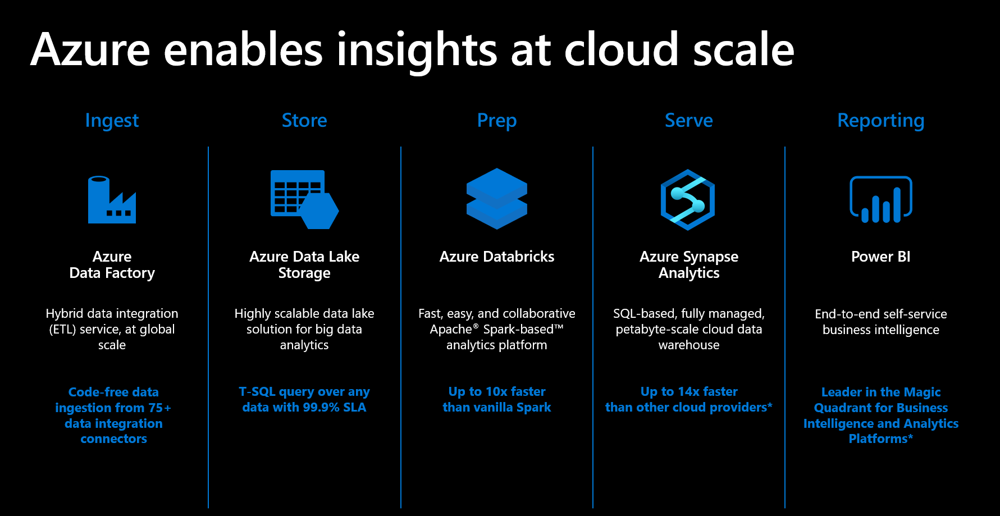
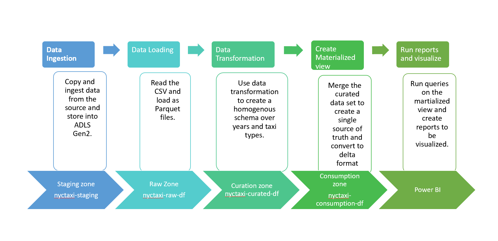
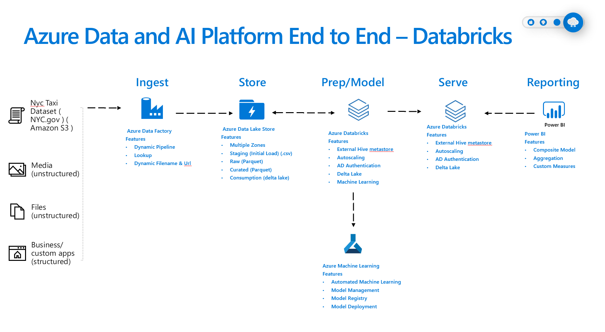
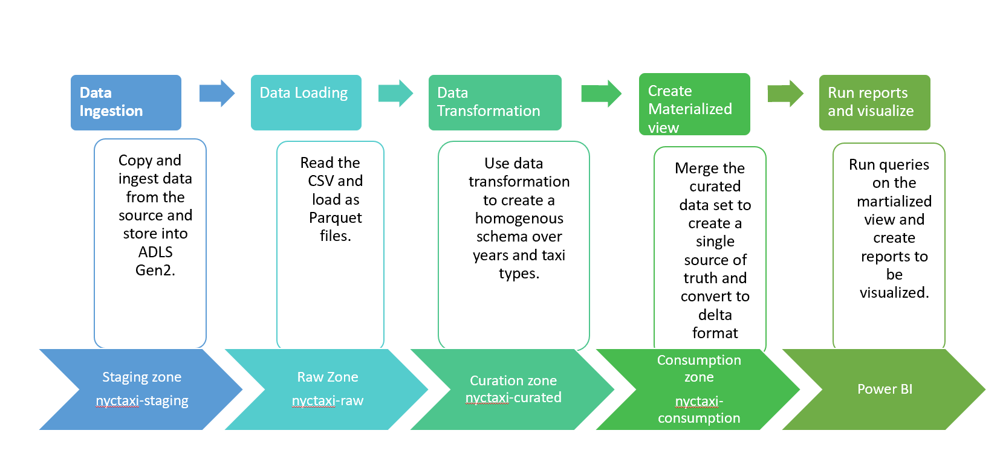

**Architecture**

With Azure you can make insights accessible to all your teams, using
analytics solutions compatible with your existing development, business
intelligence and data science tools.

-   For **ingestion**, Azure Data Factory provides code-free data
    ingestion from 75+ data integration connectors.

-   For **data store**, our Azure Data Lake Storage offers highly
    scalable data lake solution for big data analytics, and our PolyBase
    functionality allow you to use simple t-SQL queries for your data
    with a 99.9% SLA

-   In **prepping data**, Azure Databricks offers Spark-based analytic
    at up to 10x the speed of vanilla Spark.

-   To **serve data Azure Synapse Analytics gives you a petabyte-scale
    cloud data warehouse** with 14x faster performance than other cloud
    providers.

-   Finally, **drive insights** from your data with Power BI, our
    end-to-end self-service cloud BI offering, which is a Gartner Magic
    Quadrant leader

Following is the reference architecture to enable cloud scale analytics
using Azure services.

For the template we used two different variations of this architecture.

Azure Data Factory
------------------

Azure databricks 
----------------

Process
Steps:

