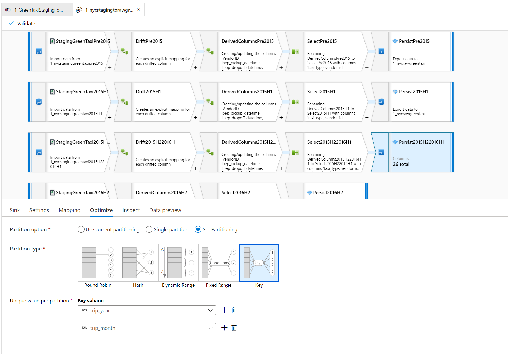
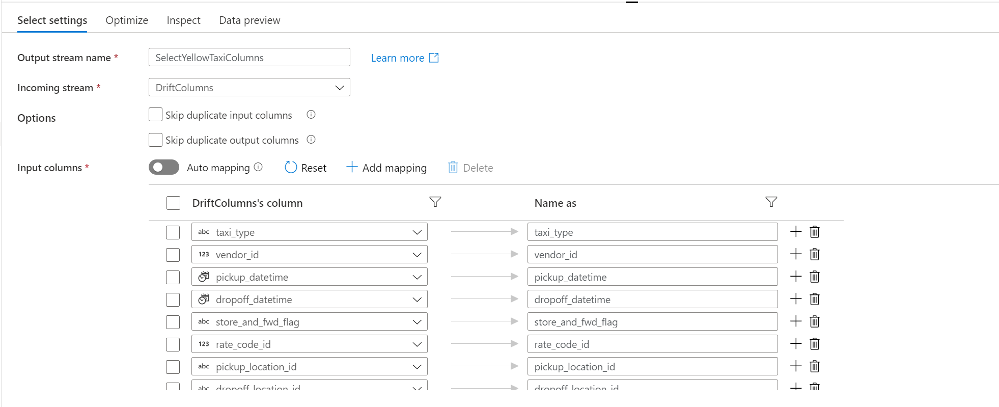

**Technical Deep Dive**

General
=======

[IaC](https://docs.microsoft.com/en-us/azure/devops/learn/what-is-infrastructure-as-code)
– Using [Infrastructure as a
code](https://docs.microsoft.com/en-us/dotnet/architecture/cloud-native/infrastructure-as-code)
(using
[ARM](https://docs.microsoft.com/en-us/azure/azure-resource-manager/management/overview)
templates as API provisioning engine) to automate platform provisioning
for end-to-end architecture services (azure data factory, databricks,
azure machine learning, SQL server and others)

Azure Data Factory
==================

Azure Data Factory is Azure's cloud ETL service for scale-out serverless
data integration and data transformation. It offers a code-free UI for
intuitive authoring and single-pane-of-glass monitoring and management.
You can also lift and shift existing SSIS packages to Azure and run them
with full compatibility in ADF. SSIS Integration Runtime offers a fully
managed service, so you don't have to worry about infrastructure
management.

Following features of the Azure Data factory are showcased in the
End-To-End architecture:

-   [Lookup
    Activity](https://docs.microsoft.com/en-us/azure/data-factory/control-flow-lookup-activity)
    – To copy the data from the source (Amazon S3), we are using Lookup
    activity to read the return the content of the configuration file
    (greentaxi\_lookup.csv and yellowtaxi\_lookup.csv). The output from
    the lookup activity is used in subsequent copy activity

-   

-   [Variable
    Activity](https://docs.microsoft.com/en-us/azure/data-factory/control-flow-set-variable-activity)
    – Variable activity is used dynamically set the URL to download the
    data from Amazon S3 based on the lookup value.

-   

-   [Mapping Data
    Flow](https://docs.microsoft.com/en-us/azure/data-factory/concepts-data-flow-overview) -
    Mapping data flows are used to run on ADF-managed execution clusters
    for scaled-out data processing. Following is the example data flow
    that supports processing different schema from the source

-   

-   For the file-based dataset (CSV – when we process the data from
    Staging to RAW), we are using
    [wildcards](https://docs.microsoft.com/en-us/azure/data-factory/data-flow-source#source-options)
    path to process more than one file/folder at a time. Since we are
    supporting deployment on full dataset or the partial dataset, “Allow
    no files found” checkbox will continue processing (and not generate
    error) in case of partial dataset.

-   

-   [Schema
    Drift](https://docs.microsoft.com/en-us/azure/data-factory/concepts-data-flow-schema-drift)
    – Since the NYCTaxi dataset schema has evolved over the years, with
    schema drift, fields/columns/types can be added/removed or change on
    the fly.

-   

-   [Data Transformation
    expression](https://docs.microsoft.com/en-us/azure/data-factory/data-flow-expression-functions)
    – In data flow we are using expression to configure data
    transformation

-   

-   [Partitioning](https://docs.microsoft.com/en-us/azure/data-factory/concepts-data-flow-performance#optimize-tab)
    – To optimize the performance partitioning scheme of the Spark
    cluster is configured to partition the data after the transformation
    is completed. Adjusting the partitioning provides control over the
    distribution of data cross compute nodes. Key partitioning is used
    to create partitions for each unique value in column.

-   

-   [Column
    Pattern](https://docs.microsoft.com/en-us/azure/data-factory/concepts-data-flow-column-pattern)

-   

-   Additional mapping data flow
    [transformation](https://docs.microsoft.com/en-us/azure/data-factory/data-flow-transformation-overview)
    like
    [Join](https://docs.microsoft.com/en-us/azure/data-factory/data-flow-join),
    [Select](https://docs.microsoft.com/en-us/azure/data-factory/data-flow-select),
    [Sink](https://docs.microsoft.com/en-us/azure/data-factory/data-flow-sink),
    [Derived
    Column](https://docs.microsoft.com/en-us/azure/data-factory/data-flow-derived-column),
    [Source](https://docs.microsoft.com/en-us/azure/data-factory/data-flow-source),
    [Union](https://docs.microsoft.com/en-us/azure/data-factory/data-flow-union)

-   

-   

-   

-   

-   Run
    [Databricks](https://docs.microsoft.com/en-us/azure/data-factory/transform-data-using-databricks-notebook)
    notebook from ADF

Data Lake
=========

Data Lake Storage Gen2 is used as the foundation for building enterprise
data lakes. Data Lake Gen2 is Designed from the start to service
multiple petabytes of information while sustaining hundreds of gigabits
of throughput.

For the architecture we have taken a simple approach by creating zones
that can be expanded to build out organically as more sophisticated
use-cases arises. The zones may be called differently, by the
organization, but conceptually they have the same purpose.

-   Raw Zone – Raw zone usually will store the largest amount of data
    and with support from ADLS gen2 we can take advantage of the
    [lifecycle management
    policy](https://docs.microsoft.com/en-us/azure/storage/blobs/storage-lifecycle-management-concepts?tabs=azure-portal).
    The policy can be applied at the account, file system or folder
    level.

-   Staging Zone –

-   Curated Zone - Typically this zone is usually business driven rather
    to source data driven. More granular permissions can be applied to
    Curated zone.

-   Consumption Zone – Consumption zone is optimized for analytics as
    compared to ingestion or processing of the data. It usually will
    store the data in denormalized data form. This zone will become a
    key point if you want to consider making Data lake as source of
    truth.

-   Folder Structure – Partitioning strategy are implemented to optimize
    access patterns and use of compressed formats.

Refer to a good blog from Nicholas Hurt on Building [Data
Lake](https://cloudblogs.microsoft.com/industry-blog/en-gb/technetuk/2020/04/09/building-your-data-lake-on-azure-data-lake-storage-gen2-part-1/)
using
[ADLS](https://cloudblogs.microsoft.com/industry-blog/en-gb/technetuk/2020/04/16/building-your-data-lake-on-azure-data-lake-storage-gen2-part-2/).

Databricks
==========

Azure Databricks is used for processing, building machine learning
models and structured streaming scenarios.

-   [External Hive
    metastore](https://docs.microsoft.com/en-us/azure/databricks/data/metastores/external-hive-metastore)
    – SQL server is used as underlying metastore database. The metastore
    client runs inside a cluster connecting to underlying metastore
    using JDBC. The
    [spark](https://docs.microsoft.com/en-us/azure/databricks/data/metastores/external-hive-metastore#spark-options)
    configuration of the metastore is defined in the Advanced option of
    the Cluster in databricks

-   

-   

-   [Materialized view
    pattern](https://docs.microsoft.com/en-us/azure/architecture/patterns/materialized-view)

-   [Delta
    Lake](https://docs.microsoft.com/en-us/azure/databricks/delta/) –
    Delta lake tables are created to store the information.

-   [Jobs](https://docs.microsoft.com/en-us/azure/databricks/jobs) –
    Deployment takes advantage of running notebooks as Databricks jobs

-   [Pass through
    authentication](https://docs.microsoft.com/en-us/azure/databricks/security/credential-passthrough/adls-passthrough)
    – Credential passthrough authentication is used to authenticate
    automatically to ADLS from databricks clusters.

Power BI
========

-   [Composite Data
    model](https://docs.microsoft.com/en-us/power-bi/transform-model/desktop-composite-models)
    – Combining the data from DirectQuery and import data.

-   

-   [Custom
    Measures](https://docs.microsoft.com/en-us/power-bi/transform-model/desktop-measures)[Databricks
    Connector](https://docs.microsoft.com/en-us/azure/databricks/integrations/bi/power-bi)

Data Ingestion 
==============

Data factory has multiple connectors that allow data to be ingested from
various sources in the cloud or on prem. It also allows dynamic path
modifications during data copy. In this case, the source data has a flat
hierarchy, but we want to store as partition data in the Year and Month
hierarchy according to the taxi type. So, we would use dynamic content
from source file name to create the folder structure.

Following 2 pipelines are used to ingest data into data lake:

0\_GreenTaxiCopyToStaging and 0\_YellowTaxiCopyToStaging

**Pipeline execution steps:**

-   Read the lookup table (csv file) that was uploaded as a part of
    deployment.

    -   

-   Foreach row:

    -   Build relative URL to download the source from Amazon S3.

        -   

    -   Copy data from Amazon S3 -&gt; Data Lake.

        -   

**Successful execution of the pipeline will create following data in
datalake (staging zone)
(nyctaxi-staging/transactional-data/type=**&lt;taxi-type&gt;**/year=**&lt;Year&gt;**/month=**&lt;Month&gt;**/\*csv)**

Data Pipelines 
==============

Once the data is ingested form the data source and loaded into data
lake, set of data pipelines are executed to move the data to different
zones performing transformation and enrichment. For each of the pipeline
dataflow and databricks notebooks are executed.

**Following are the set of the data pipelines:**

**Each pipeline follows the same pattern as below:**

Staging to Raw -&gt; **Staging to Raw pipeline converts the CSV file
from the staging to Parquet format.**

-   Reference dataflow executes simple flow of conversion from source to
    sink.

    -   

-   Yellow Taxi and GreenTaxi Staging to Raw executes the dataflow to
    process the source dataset that is available in different schema,
    creating derived columns(to add or remove missing columns) ,
    explicit drift mapping and creating final unified schema for all
    different source dataset.

    -   

    -   Sink dataset are partitioned by trip\_year/trip\_month

    -   

-   Yellow Taxi and GreenTaxi Raw to Curated executes the dataflow to
    join the dataset with the reference data and persists the data into
    curated zone with data partitioned by trip\_year and trip\_month

    -   

-   Finally, Both yellow taxi and green taxi data are combined and
    materialized view is created (Union data from both green and yellow
    taxi) for consumption of data into visualization tool.

    -   
