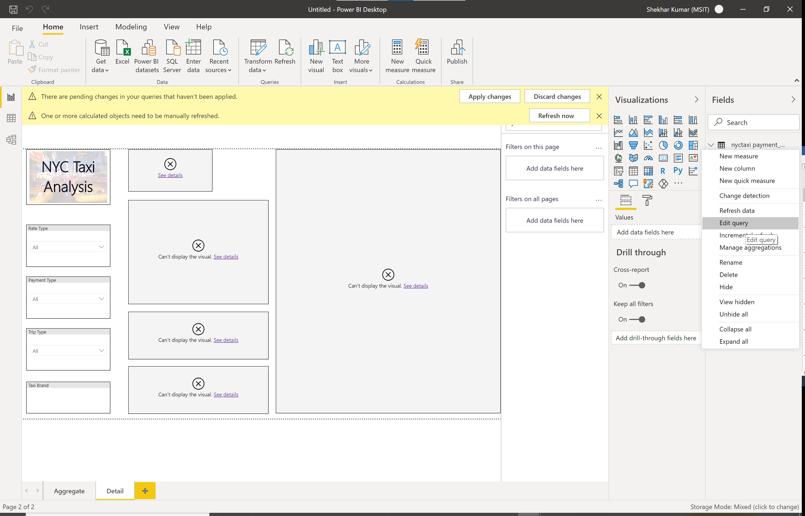

**Deployment**

Step 0 - Before you start (Pre-requisites)
==========================================

These are the key pre-requisites to deploy this solution:

-   You need a Microsoft Azure account to create the services used in
    this solution. You can create a [<u>free
    account</u>](https://azure.microsoft.com/en-us/free/), use your MSDN
    account, or any other subscription where you have permission to
    create Azure services.

-   PowerShell: The one-command deployment process uses PowerShell to
    execute all the required activities to get the solution up and
    running. If you don't have PowerShell, install it
    from [<u>here</u>](https://docs.microsoft.com/en-us/powershell/scripting/install/installing-windows-powershell?view=powershell-6).
    Direct link to [<u>MSI
    download</u>](https://github.com/PowerShell/PowerShell/releases/download/v6.2.3/PowerShell-6.2.3-win-x64.msi).
    If you have an older version of PowerShell, you will have to update
    to the latest version.

Step 1 - Environment Setup
==========================

Follow these steps to prepare the deployment:

-   Run the PowerShell terminal as an Administrator

-   Set the priorities running (every time you restart the
    PowerShell) Set-ExecutionPolicy -ExecutionPolicy unrestricted.
    (Choose "A", to change the policy to Yes to All)

-   Install following Azure Module (one-time)

    -   *Install-Module -Name Az -AllowClobber -Scope AllUsers*

    -   *Install-Module -Name Az.Resources -AllowClobber -Scope
        AllUsers*

    -   *Install-Module -Name SqlServer -Force*

    -   *Install-Module -Name azure.databricks.cicd.tools
        -MinimumVersion 2.1.2915 -Force*

    -   Download the end to end demo repository from the github
        [link](https://github.com/akshata29/msdaie2e). Clone the repo,
        using [Git for Windows](https://gitforwindows.org/) or any other
        git app you want. The command is git clone
        <https://github.com/akshata29/msdaie2e>.

Step 2 – Deployment (Azure Data Factory Architecture)
=====================================================

-   Run the PowerShell terminal as an Administrator

-   Go to to \\deploy\\scripts folder

-   Choose a unique name with 3 or more nonspecial characters with no
    spaces. It will be used as the suffix of the name of all Azure
    resources. If the name is already used, the deployment will fail.
    The name will be converted to lowercase.

-   Get the subscription id from the Azure Portal.

-   Using the information collected above, run following command:

> *.\\DeployAdf.ps1 -uniqueName &lt;unique\_name&gt; -subscriptionId
> &lt;subscription\_id&gt; -location &lt;location&gt;*

-   If you have not logged in, the script might ask you to authenticate
    via the web browser.

-   As a part of the installation it will ask you if you want to load
    the scenario with Full dataset or partial dataset. The partial
    dataset includes the data from years 2017-2019 and the full dataset
    has the entire data set mentioned in the dataset section. This
    allows you to have quicker deployment.

> 

-   Following artifacts will be deployed:

    -   Storage Account

        -   Container – Uploaded with reference data

        -   

    -   SQL Server and Database – For external hive metastore

        -   

    -   Service Principal

    -   Azure Databricks

        -   Create a new workspace.

            -   Create a new cluster.

            -   

            -   

    -   Create ADF

        -   Deploy linked service, datasets, dataflow and pipelines.

        -   Execute Source -&gt; Staging pipelines.

            -   

            -   

        -   Execute Staging -&gt; Raw pipelines.

            -   

            -   

        -   Execute Raw -&gt; Curated pipelines

            -   

            -   

            -   Note: Sometimes as a part of the deployment
                2\_GreenTaxiToCurated fails with error below.

                -   Operation on target 2\_GreenTaxiRawToCurated failed:
                    {"StatusCode":"DFExecutorUserError","Message":"Job
                    failed due to reason: Column name used in expression
                    is unavailable or invalid","Details":"at Select
                    'ReorderAndRenamePickupZone'(Line 141/Col 17):
                    Column 'RawRateCode@rate\_code\_id' not found. The
                    stream is either not connected or column is
                    unavailable"}

                -   If it does, follow steps below and re-run.

                    -   Go to Pipeline -&gt; Data flows -&gt;
                        Raw\_To\_Curated -&gt;
                        2\_nycrawtocuratedgreentaxidf. Select
                        ReorderAndRenamePickupZone settings, select
                        rawratecode@rate\_code\_id (just so that we can
                        keep same settings and republish) -&gt; Publish
                        all -&gt; Publish.

            -   

            -   Re-run the pipeline

            -   

        -   Execute Curated -&gt; Consumption Pipeline.

            -   

        -   Note – In case of any job failure, you can manually run the
            pipeline in following order.

            -   0\_GreenTaxiCopyToStaging

            -   0\_YellowTaxiCopyToStaging

            -   1\_ReferenceStagingToRaw

            -   1\_GreenTaxiStagingToRaw

            -   1\_YellowTaxiStagingToRaw

            -   2\_YellowTaxiRawToCurated

            -   2\_GreenTaxiRawToCurated

            -   3\_CuratedToConsumption

Step 2 – Deployment (Azure DataBricks Architecture)
===================================================

-   Run the PowerShell terminal as an Administrator

-   Go to to \\deploy\\scripts folder

-   Choose a unique name with 3 or more nonspecial characters with no
    spaces. It will be used as the suffix of the name of all Azure
    resources. If the name is already used, the deployment will fail.
    The name will be converted to lowercase.

-   Get the subscription id from the Azure Portal.

-   Using the information collected above, run following command:

> *.\\DeployAdb.ps1 -uniqueName &lt;unique\_name&gt; -subscriptionId
> &lt;subscription\_id&gt; -location &lt;location&gt;*

-   If you have not logged in, the script might ask you to authenticate
    via the web browser. As a part of the installation it will ask you
    if you want to load the scenario with Full dataset or partial
    dataset.

> 

-   Following artifacts will be deployed:

    -   Storage Account

        -   Container – Uploaded with reference data

        -   

    -   SQL Server and Database – For external hive metastore

        -   

    -   Service Principal

    -   Azure Databricks

        -   Create a new workspace.

            -   Create a new cluster.

            -   

            -   Install Databricks notebooks in Shared workspace

            -   

            -   Execute jobs

            -   

            -   

        -   Note – In case of any job failure, you can manually run the
            notebooks/jobs in following order.

            -   Setup

            -   Loadrefdata

            -   Loadgreentaxi

            -   Loadyellowtaxi

            -   Transformgreentaxi

            -   Transformyellowtaxi

            -   consumption

            -   Amlsetup

            -   Featureengg

            -   modeltraining

    -   Create ADF

        -   Ingest data from the source (executing pipeline)

    -   Create AML Service

        -   Execute AML Jobs on databricks

            -   AMLSetup

            -   FeatureEngg

            -   ModelTraining

Deployed Artifacts

If you go on to the Azure portal and navigate to the resource group
specified. You should see these artifacts.

Step 3 – Monitoring and observing data transformation and movement 
==================================================================

The data processing as discussed in the architecture section, this
solution uses the concept of zones to demarcate various steps in
processing the data.

-   Data Ingestion – The data ingestion process copies data from the
    Amazon s3 data store. The data is stored in a hierarchical format in
    the ADLS gen2 data lake store. This would later help us in creating
    partitions. The data factory pipeline is used to ingest this data.
    Jump to the Data ingestion part of the “Technical Deep Dive
    Section”.

-   Data Storage – The stored data is in the staging zone (container) in
    the data lake. For Azure Data factory deployment, the name of the
    staging container is nyctaxi-staging-df, for Databricks deployment
    df postfix is eliminated. You can inspect these files by either
    browsing the storage account through the portal or [Azure Storage
    Explorer](https://azure.microsoft.com/en-us/features/storage-explorer/).
    The name of the storage account is the unique name given at time of
    the installation followed by a postfix “sa”.

> 
> 

-   Data Preparation: As discussed in the technical objectives section,
    this is a huge dataset in csv format. Along with that there are
    multiple schema differences across taxi types and years. To run
    analytics, we first convert the csv files into big data friendly
    parquet format and store them in the data lake. This is our new raw
    dataset which ready for big data processing. This is stored in the
    nyctaxi\_raw\_df (Data Factory), nyctaxi\_raw .

> 
>
> The next, is to plug in all reference data value, adjust schema drift
> and bring individual taxi data sets together. This transformed data
> set is stored in the curated zone NYC-taxi-curated.
>
> 
>
> Finally, building on top of this dataset we merge both green and
> yellow taxi dataset together to build a final materialized view that
> can serve as a single source of truth for all our analytical queries
> and machine learning algorithms. This final dataset is stored as in
> the consumption zone.
>
> 
>
> Jump to the “Data Factory” section of the technical deep dive to
> understand the pipeline/notebook features used to achieve this.

-   Data Serve: While the dataset will live in the data lake storage, we
    would use data virtualization features to serve directly to
    analytical queries. Jump to the “Hive Meta Store” section of the
    “Technical deep dive” to learn more details on data virtualization.

-   Visualization: In the architecture we will use powerBi to visualize
    reports. Here we would use the mixed model i.e. use both local
    storage and our virtual data store through databricks. Jump to the
    “PowerBI” section of the notebook to get more in depth
    understanding.

Step 4 – Data visualization and reporting 
=========================================

-   Download [PowerBI desktop](https://aka.ms/pbidesktopstore)

-   Open the PowerBI report template from the downloaded github repo.
    Additionally, you can download the PowerBI report from the github.
    There is one template each for Azure Data Factory \_Adf and Azure
    databricks \_Adb

> 

-   Cancel the potential security risk screen

-   On the next popup press cancel as shown below and press close on the
    pop up below that

> 

-   In the fields section, On the first table click on the 3 dots and
    click on edit query.

-   Click on source on each of the tables with a caution sign

-   Log in to your databricks workspace and navigate to cluster - &gt;
    click on external hive and then on “Advanced settings”. On advanced
    settings click on JDBC/ODBC and copy the server hostname and HTTPS
    path. Replace this value in PowerBI open window.

-   Do it for all tables which have caution sign, and the click on close
    and apply on top left hand corner.

-   If you see a pop up in a yellow ribbon to apply changes click on
    that

-   Now you can connect to Azure databricks when the dialogue pops up.
    First click sign in, and then click connect. Let the data load. You
    should be able to see the report popup.

