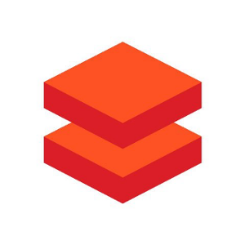

Abstract
========

Data volumes are exploding—from traditional point-of-sale systems and
e-commerce websites to new customer sentiment sources like Twitter and
IoT sensors that stream data in real time using Apache Hadoop and Spark.
By analyzing a diverse dataset from the start, organizations can make
more informed decisions that are predictive and holistic rather than
reactive and disconnected.

However, designing operational big data analytics workload is a complex
task. This is further compounded by the overload of product choices as
well as the fine-tuning options within them. In practice, this means
that both sellers and customers end up spending a major chunk of their
time and focus on configuration, troubleshooting and tuning of different
components. Not only does this add delays to the sales cycle, but also,
most time allows only a component or some features of it to be
highlighted than bringing out the business value of end to end solution.

Azure Data Factory Azure Data lake Gen2 Azure Databricks Azure Machine
Learning

The purpose of this pattern/template is to highlight the usage of
Microsoft big data analytics tools to ingest, transform and analyze a
real-life big data set and to showcase the business value created by
these offerings. This demo uses a range of Azure big data offerings such
as Azure Data Factory, Azure Databricks, Machine Learning, Power BI and
Azure Sql. Further, the demo underlines the key best practices for
designing a big data analytics workload at the enterprise level using
these tools.

The solution is targeted to be used by both non-technical and technical
audience across the sales organization. The deployment of the demo is
completely automated using PowerShell scripts. The automation framework
not only allows completely hands-off deployment of the entire solution,
but also facilitates options to customize it according to customer asks,
such as Databricks based solution or Data factory-based solution or
streaming data solutions. Further, based on the focus and time
availability the data volume can be scaled up or scaled down during the
deployment.

Dataset used in this solution is open public data so the demo can also
be shared directly with the customers to be used as a learning sandbox
or as a reference architecture to build on.

Target Audience
===============

-   Data Engineers

-   Data analysts

-   Machine learning engineers

-   Data and AI sales

Technologies
============

-   Azure Data Factory

-   Azure Machine Learning

-   Power BI

-   Azure Data Lake

-   Azure Databricks

Objective
=========

Business Objectives
-------------------

The key goal for the end enterprise business user is the ability to see
the descriptive analytics of the entire disparate dataset as a single
source of truth. This might allow them answer business questions such as
“Average ride time in May 2013 for Yellow Taxis” or “Variation of ride
volume by hour on weekdays vs weekends”. In addition, enterprise
business users might want a dynamic dashboard that allows them the chop
and slice their views at runtime. Further, end users might also want
predictive analytics solutions such as “Probability of receiving a tip”
or “Overall demand for taxis in a particular borough on a Sunday”. The
final frontier for an enterprise user will be to get to prescriptive
analytics from the dataset and generate recommendations such as dynamic
fair pricing.

Technical Objectives
--------------------

The technical goals for the demo stem from the needs of the enterprise
business user, the scale of the dataset and the differences in data
profile across taxi types, years and month. In order to create a single
source of truth (materialized view), for the entire enterprise, the data
analytics solution should be able to homogenize the data across taxi
types and time which can be fairly challenging for datasets this big
with over 1.6 Billion records if deployed fully. Additionally, to allow
business users to dynamically slice and chop their views on run time,
all queries should have very low latency. To support predictive and
perspective analytics our solution should allow Machine learning to be
applied to the entire data set. Further, the architecture for the
solution should be scalable for future expansion and support devops like
continuous ingestion and production.

Architecture
============
[Architecture](Architecture.md).

Deployment
==========
[Deployment](Deployment.md).

Technical Deep-dive
===================
[Deepdive](Deepdive.md).

# Contributor
- [Shekhar Kumar](https://github.com/shkumar64)

# Special Thanks
